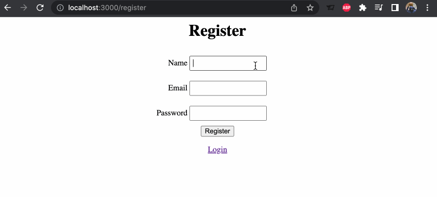
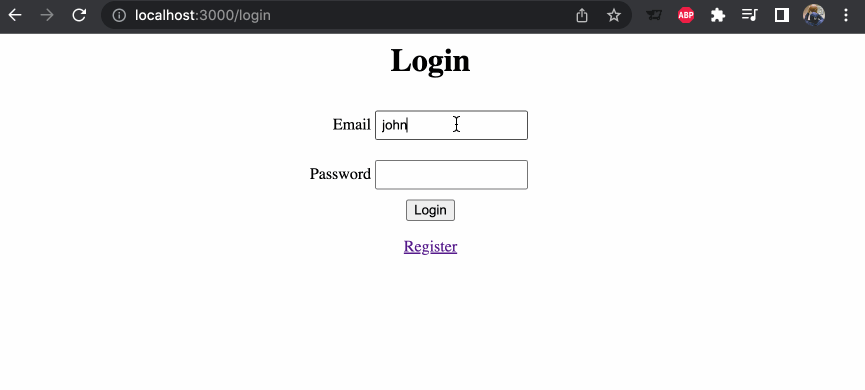

# Objective

**This project was designed to simulate the login component of typical websites. This includes the ability to register a new account, login to an existing account, and authentication checks when trying to login with an incorrect email or password.**

# Technologies Used

**JavaScript, EJS (Embedded JavaScript Templating), NodeJS, npm, Express, bcrypt, CSS**

# Lessons Learned

**In this project, I learned how bcrypt uses hashing to perform authentication checks on passwords and secure an application. Also, I gained some experience with EJS and the interesting syntax.**

# Challenges Faced

**I didn't face many challenges with this project. There was a bit of a learning curve when working with EJS, as the syntax was confusing at first, but that was it.**

# Demo

